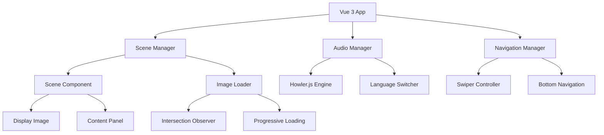

# Design Document: 線上展覽網站

## Overview

線上展覽網站是一個沉浸式的數位展覽平台，使用 Vue 3 + Vite 技術棧開發。系統提供類似實體展覽的瀏覽體驗，使用者可以透過滑動手勢或底部導覽列在不同展覽場景間切換，每個場景包含大型展示圖片、多語言語音導覽和文字介紹。

## Architecture

### 技術棧選擇
- **前端框架**: Vue 3 with Composition API
- **建置工具**: Vite (快速開發和建置)
- **樣式框架**: Tailwind CSS (響應式設計)
- **滑動組件**: Swiper.js (專業的觸控滑動支援)
- **音訊處理**: Howler.js (跨瀏覽器音訊播放)
- **圖片最佳化**: Intersection Observer API (延遲載入)

### 系統架構圖



## Components and Interfaces

### 1. 核心組件架構

#### ExhibitionApp (根組件)
```typescript
interface ExhibitionApp {
  scenes: Scene[]
  currentSceneIndex: number
  isLoading: boolean
  
  // 方法
  initializeExhibition(): void
  navigateToScene(index: number): void
  preloadAdjacentScenes(): void
}
```

#### SceneComponent (場景組件)
```typescript
interface SceneComponent {
  scene: Scene
  isActive: boolean
  isPreloaded: boolean
  
  // 方法
  loadContent(): Promise<void>
  unloadContent(): void
  handleImageLoad(): void
}
```

#### AudioGuideComponent (語音導覽組件)
```typescript
interface AudioGuideComponent {
  currentLanguage: string
  availableLanguages: string[]
  isPlaying: boolean
  progress: number
  
  // 方法
  switchLanguage(language: string): void
  play(): void
  pause(): void
  seek(position: number): void
}
```

#### NavigationComponent (導覽組件)
```typescript
interface NavigationComponent {
  scenes: Scene[]
  currentIndex: number
  
  // 方法
  jumpToScene(index: number): void
  showThumbnails(): void
  hideThumbnails(): void
}
```

### 2. Swiper.js 整合

#### SwiperController
```typescript
interface SwiperController {
  swiperInstance: Swiper
  isTransitioning: boolean
  
  // 配置
  config: {
    slidesPerView: 1
    spaceBetween: 0
    allowTouchMove: true
    keyboard: { enabled: true }
    mousewheel: { enabled: false }
    effect: 'slide'
    speed: 600
  }
  
  // 方法
  initializeSwiper(): void
  slideNext(): void
  slidePrev(): void
  slideTo(index: number): void
  onSlideChange(callback: Function): void
}
```

### 3. Howler.js 音訊管理

#### AudioManager
```typescript
interface AudioManager {
  howlerInstances: Map<string, Howl>
  currentAudio: Howl | null
  
  // 方法
  loadAudio(url: string, language: string): Promise<Howl>
  playAudio(language: string): void
  pauseAudio(): void
  stopAudio(): void
  setVolume(volume: number): void
  onProgress(callback: Function): void
}
```

## Data Models

### Scene (場景數據模型)
```typescript
interface Scene {
  id: string
  title: string
  description: Record<string, string> // 多語言描述
  image: {
    url: string
    alt: string
    width: number
    height: number
    thumbnail?: string
  }
  audio: Record<string, AudioFile> // 多語言音訊
  order: number
  metadata?: {
    artist?: string
    year?: string
    medium?: string
    dimensions?: string
  }
}
```

### ResourceConfig (資源配置模型)
```typescript
interface ResourceConfig {
  mode: 'static' | 'api' | 'hybrid'
  staticPath?: string // 靜態檔案路徑 (如: '/assets/exhibitions/')
  apiEndpoint?: string // API 端點 (如: '/api/exhibitions')
  cdnBaseUrl?: string // CDN 基礎 URL (如: 'https://cdn.example.com/')
  fallbackStrategy: 'static' | 'api' | 'none'
}
```

### AudioFile (音訊檔案模型)
```typescript
interface AudioFile {
  url: string
  duration: number
  format: 'mp3' | 'ogg' | 'wav'
  size: number
}
```

### ExhibitionConfig (展覽配置模型)
```typescript
interface ExhibitionConfig {
  id: string
  title: string
  description: string
  scenes: Scene[]
  defaultLanguage: string
  availableLanguages: string[]
  resourceConfig: ResourceConfig
  settings: {
    autoplay: boolean
    showThumbnails: boolean
    enableKeyboard: boolean
    preloadCount: number
  }
}
```

## 資源載入策略

### 1. 靜態檔案模式 (Static Mode)
適用於小型展覽或 CDN 部署：

```typescript
interface StaticResourceLoader {
  loadExhibition(exhibitionId: string): Promise<ExhibitionConfig>
  
  // 從靜態 JSON 檔案載入展覽配置
  // 路徑範例: /assets/exhibitions/exhibition-1/config.json
  loadFromStatic(path: string): Promise<ExhibitionConfig>
  
  // 圖片和音訊檔案直接從 CDN 或靜態路徑載入
  // 範例: /assets/exhibitions/exhibition-1/images/scene-1.jpg
  //      /assets/exhibitions/exhibition-1/audio/scene-1-zh.mp3
}
```

### 2. API 模式 (API Mode)
適用於動態內容管理：

```typescript
interface APIResourceLoader {
  loadExhibition(exhibitionId: string): Promise<ExhibitionConfig>
  
  // 從 REST API 載入展覽配置
  // 端點範例: GET /api/exhibitions/exhibition-1
  loadFromAPI(endpoint: string): Promise<ExhibitionConfig>
  
  // 媒體檔案可能來自 API 或 CDN
  // 範例: https://api.example.com/media/images/scene-1.jpg
  //      https://cdn.example.com/audio/scene-1-zh.mp3
}
```

### 3. 混合模式 (Hybrid Mode)
配置來自 API，媒體檔案來自 CDN：

```typescript
interface HybridResourceLoader {
  loadExhibition(exhibitionId: string): Promise<ExhibitionConfig>
  
  // 配置從 API 載入，媒體從 CDN 載入
  loadConfigFromAPI(endpoint: string): Promise<ExhibitionConfig>
  resolveMediaUrls(config: ExhibitionConfig, cdnBase: string): ExhibitionConfig
}
```

### 資源載入器實作

```typescript
class ResourceManager {
  private config: ResourceConfig
  
  constructor(config: ResourceConfig) {
    this.config = config
  }
  
  async loadExhibition(exhibitionId: string): Promise<ExhibitionConfig> {
    try {
      switch (this.config.mode) {
        case 'static':
          return await this.loadFromStatic(exhibitionId)
        case 'api':
          return await this.loadFromAPI(exhibitionId)
        case 'hybrid':
          return await this.loadHybrid(exhibitionId)
        default:
          throw new Error(`Unsupported resource mode: ${this.config.mode}`)
      }
    } catch (error) {
      return await this.handleFallback(exhibitionId, error)
    }
  }
  
  private async loadFromStatic(exhibitionId: string): Promise<ExhibitionConfig> {
    const configPath = `${this.config.staticPath}${exhibitionId}/config.json`
    const response = await fetch(configPath)
    const config = await response.json()
    
    // 解析相對路徑為完整 URL
    return this.resolveStaticUrls(config, exhibitionId)
  }
  
  private async loadFromAPI(exhibitionId: string): Promise<ExhibitionConfig> {
    const response = await fetch(`${this.config.apiEndpoint}/${exhibitionId}`)
    return await response.json()
  }
  
  private async loadHybrid(exhibitionId: string): Promise<ExhibitionConfig> {
    const config = await this.loadFromAPI(exhibitionId)
    return this.resolveCDNUrls(config)
  }
  
  private resolveStaticUrls(config: ExhibitionConfig, exhibitionId: string): ExhibitionConfig {
    const basePath = `${this.config.staticPath}${exhibitionId}/`
    
    config.scenes.forEach(scene => {
      // 解析圖片 URL
      if (!scene.image.url.startsWith('http')) {
        scene.image.url = `${basePath}images/${scene.image.url}`
      }
      
      // 解析音訊 URL
      Object.keys(scene.audio).forEach(lang => {
        if (!scene.audio[lang].url.startsWith('http')) {
          scene.audio[lang].url = `${basePath}audio/${scene.audio[lang].url}`
        }
      })
    })
    
    return config
  }
  
  private resolveCDNUrls(config: ExhibitionConfig): ExhibitionConfig {
    if (!this.config.cdnBaseUrl) return config
    
    config.scenes.forEach(scene => {
      // 如果是相對路徑，加上 CDN 前綴
      if (!scene.image.url.startsWith('http')) {
        scene.image.url = `${this.config.cdnBaseUrl}${scene.image.url}`
      }
      
      Object.keys(scene.audio).forEach(lang => {
        if (!scene.audio[lang].url.startsWith('http')) {
          scene.audio[lang].url = `${this.config.cdnBaseUrl}${scene.audio[lang].url}`
        }
      })
    })
    
    return config
  }
  
  private async handleFallback(exhibitionId: string, error: Error): Promise<ExhibitionConfig> {
    console.warn(`Primary resource loading failed: ${error.message}`)
    
    switch (this.config.fallbackStrategy) {
      case 'static':
        return await this.loadFromStatic(exhibitionId)
      case 'api':
        return await this.loadFromAPI(exhibitionId)
      default:
        throw error
    }
  }
}
```

### 部署配置範例

#### 小型展覽 - 純靜態部署
```typescript
const staticConfig: ResourceConfig = {
  mode: 'static',
  staticPath: '/assets/exhibitions/',
  fallbackStrategy: 'none'
}

// 檔案結構:
// /assets/exhibitions/
//   ├── gold-leaf/
//   │   ├── config.json
//   │   ├── images/
//   │   │   ├── scene-1.jpg
//   │   │   └── scene-2.jpg
//   │   └── audio/
//   │       ├── scene-1-zh.mp3
//   │       └── scene-1-en.mp3
```

#### 中型展覽 - API + CDN
```typescript
const hybridConfig: ResourceConfig = {
  mode: 'hybrid',
  apiEndpoint: '/api/exhibitions',
  cdnBaseUrl: 'https://cdn.example.com/exhibitions/',
  fallbackStrategy: 'static'
}
```

#### 大型展覽 - 完全動態
```typescript
const apiConfig: ResourceConfig = {
  mode: 'api',
  apiEndpoint: '/api/exhibitions',
  fallbackStrategy: 'static'
}
```

## 響應式設計策略

### Tailwind CSS 斷點配置
```css
/* 自定義斷點 */
sm: '640px'   // 手機橫向
md: '768px'   // 平板直向
lg: '1024px'  // 平板橫向/小筆電
xl: '1280px'  // 桌面
2xl: '1536px' // 大螢幕
```

### 版面配置策略

#### 桌面版 (lg+)
- 左側：大型展示圖片 (70% 寬度)
- 右側：語音控制和文字介紹 (30% 寬度)
- 底部：水平導覽列

#### 平板版 (md-lg)
- 上方：展示圖片 (60% 高度)
- 下方：語音控制和文字介紹 (40% 高度)
- 底部：導覽列

#### 手機版 (sm-)
- 上方：展示圖片 (50% 高度)
- 中間：語音控制區域 (25% 高度)
- 下方：文字介紹區域 (20% 高度)
- 底部：導覽列 (5% 高度)

### 響應式組件實作
```vue
<template>
  <div class="exhibition-container">
    <!-- 桌面版：左右分欄 -->
    <div class="hidden lg:flex lg:h-screen">
      <div class="lg:w-2/3 xl:w-3/4">
        <ImageDisplay :scene="currentScene" />
      </div>
      <div class="lg:w-1/3 xl:w-1/4">
        <ContentPanel :scene="currentScene" />
      </div>
    </div>
    
    <!-- 行動版：上下堆疊 -->
    <div class="lg:hidden flex flex-col h-screen">
      <div class="flex-1 md:h-3/5">
        <ImageDisplay :scene="currentScene" />
      </div>
      <div class="h-2/5 md:h-2/5">
        <ContentPanel :scene="currentScene" />
      </div>
    </div>
    
    <!-- 底部導覽列 -->
    <BottomNavigation 
      :scenes="scenes" 
      :current-index="currentIndex"
      class="fixed bottom-0 w-full"
    />
  </div>
</template>
```

## 效能最佳化策略

### 1. 圖片載入最佳化

#### Intersection Observer 實作
```typescript
class ImageLoader {
  private observer: IntersectionObserver
  
  constructor() {
    this.observer = new IntersectionObserver(
      this.handleIntersection.bind(this),
      {
        rootMargin: '50px',
        threshold: 0.1
      }
    )
  }
  
  observeImage(element: HTMLImageElement): void {
    this.observer.observe(element)
  }
  
  private handleIntersection(entries: IntersectionObserverEntry[]): void {
    entries.forEach(entry => {
      if (entry.isIntersecting) {
        this.loadHighResImage(entry.target as HTMLImageElement)
        this.observer.unobserve(entry.target)
      }
    })
  }
}
```

### 2. 預載策略
- 當前場景：載入高解析度圖片和音訊
- 相鄰場景：預載縮圖和音訊檔案
- 其他場景：僅載入基本資訊

### 3. 音訊最佳化
```typescript
class AudioPreloader {
  preloadAudio(scenes: Scene[], currentIndex: number): void {
    // 預載當前和相鄰場景的音訊
    const indicesToPreload = [
      currentIndex - 1,
      currentIndex,
      currentIndex + 1
    ].filter(i => i >= 0 && i < scenes.length)
    
    indicesToPreload.forEach(index => {
      this.loadSceneAudio(scenes[index])
    })
  }
}
```

## Error Handling

### 錯誤處理策略

#### 1. 圖片載入失敗
```typescript
interface ImageErrorHandler {
  handleImageError(scene: Scene): void {
    // 顯示預設圖片
    // 記錄錯誤日誌
    // 嘗試重新載入
  }
}
```

#### 2. 音訊載入失敗
```typescript
interface AudioErrorHandler {
  handleAudioError(audioFile: AudioFile): void {
    // 嘗試備用格式
    // 顯示載入失敗訊息
    // 提供手動重試選項
  }
}
```

#### 3. 網路連線問題
```typescript
interface NetworkErrorHandler {
  handleNetworkError(): void {
    // 使用快取內容
    // 顯示離線模式提示
    // 監聽網路恢復
  }
}
```

## Testing Strategy

### 單元測試
- Vue 組件測試 (Vue Test Utils)
- 音訊管理器測試
- 圖片載入器測試
- 導覽邏輯測試

### 整合測試
- Swiper.js 整合測試
- Howler.js 整合測試
- 響應式佈局測試

### 端對端測試
- 完整使用者流程測試
- 跨裝置相容性測試
- 效能測試

### 測試工具
- **單元測試**: Vitest + Vue Test Utils
- **E2E 測試**: Playwright
- **視覺回歸測試**: Chromatic
- **效能測試**: Lighthouse CI

## Correctness Properties

*A property is a characteristic or behavior that should hold true across all valid executions of a system-essentially, a formal statement about what the system should do. Properties serve as the bridge between human-readable specifications and machine-verifiable correctness guarantees.*

### Property 1: Scene Layout Consistency
*For any* exhibition scene, when loaded on desktop devices, the display image should appear on the left side and the content panel (audio controls and text) should appear on the right side
**Validates: Requirements 1.1, 1.2**

### Property 2: Image Quality Standards
*For any* loaded scene image, the image should meet minimum resolution requirements and maintain proper aspect ratio
**Validates: Requirements 1.3**

### Property 3: Multimedia Control Interface Uniformity
*For any* scene containing multimedia content, the system should provide consistent playback control elements across all content types
**Validates: Requirements 1.4**

### Property 4: Interactive Feedback Responsiveness
*For any* user interaction with interface elements, the system should provide immediate visual feedback within 100ms
**Validates: Requirements 1.5**

### Property 5: Language Options Availability
*For any* scene, the audio guide should display all configured available languages in the language selector
**Validates: Requirements 2.1**

### Property 6: Language Content Loading
*For any* selected language, the audio guide should load the corresponding audio file and text content for that language
**Validates: Requirements 2.2**

### Property 7: Audio Control Interface Completeness
*For any* playing audio, the audio guide should display play, pause, and replay control buttons
**Validates: Requirements 2.3**

### Property 8: Audio-Text Synchronization
*For any* playing audio, the corresponding text content should be displayed synchronously
**Validates: Requirements 2.4**

### Property 9: Language Switch State Preservation
*For any* language switch during audio playback, the current playback progress should be preserved and applied to the new language
**Validates: Requirements 2.5**

### Property 10: Bidirectional Swipe Navigation
*For any* scene that is not at the boundaries, left swipe should navigate to the next scene and right swipe should navigate to the previous scene
**Validates: Requirements 3.1, 3.2**

### Property 11: Swipe Transition Animation
*For any* triggered swipe gesture, the system should provide smooth scene transition animation
**Validates: Requirements 3.3**

### Property 12: Boundary Swipe Protection
*For any* scene at the first or last position, swipe gestures in the blocked direction should be prevented (right swipe at first scene, left swipe at last scene)
**Validates: Requirements 3.4, 3.5**

### Property 13: Navigation Bar Scene Representation
*For any* loaded exhibition, the bottom navigation bar should display representations (thumbnails or indicators) for all scenes
**Validates: Requirements 4.1**

### Property 14: Navigation Bar Jump Functionality
*For any* clicked navigation bar item, the system should jump directly to the corresponding scene
**Validates: Requirements 4.2**

### Property 15: Navigation Bar State Synchronization
*For any* scene change, the navigation bar should highlight the current scene's position
**Validates: Requirements 4.3**

### Property 16: Navigation Bar Overflow Handling
*For any* navigation bar with more items than can fit in the viewport, horizontal scrolling functionality should be enabled
**Validates: Requirements 4.4**

### Property 17: Navigation Jump Animation
*For any* navigation bar jump action, the system should provide smooth transition animation
**Validates: Requirements 4.5**

### Property 18: Responsive Layout Adaptation
*For any* screen size, the system should apply the appropriate layout: left-right columns for desktop, adjusted proportions for tablet, and top-bottom stacking for mobile
**Validates: Requirements 5.1, 5.2, 5.3**

### Property 19: Orientation Change Responsiveness
*For any* screen orientation change, the system should automatically readjust the layout configuration
**Validates: Requirements 5.4**

### Property 20: Touch-Friendly Interface Optimization
*For any* touch device, button sizes and spacing should meet touch-friendly minimum requirements (44px minimum touch target)
**Validates: Requirements 5.5**

### Property 21: Scene Loading Performance
*For any* scene loading, basic content should be displayed within 2 seconds
**Validates: Requirements 6.1**

### Property 22: Progressive Loading Strategy
*For any* scene with large images, progressive loading techniques should be applied, and adjacent scenes should be preloaded
**Validates: Requirements 6.2, 6.3**

### Property 23: Audio Loading Progress Indication
*For any* audio file loading, a progress indicator should be displayed
**Validates: Requirements 6.4**

### Property 24: Slow Network Loading Priority
*For any* slow network condition, text content and low-resolution images should be loaded before high-resolution media
**Validates: Requirements 6.5**

### Property 25: Content Management Form Completeness
*For any* new scene creation, the system should provide complete forms for image upload and content configuration
**Validates: Requirements 7.2**

### Property 26: Audio Format Support
*For any* uploaded audio file in supported formats (MP3, OGG, WAV), the system should process and convert it correctly
**Validates: Requirements 7.3**

### Property 27: Scene Reordering Functionality
*For any* scene list in management interface, drag-and-drop reordering should be functional
**Validates: Requirements 7.4**

### Property 28: Real-time Content Updates
*For any* published exhibition changes, the frontend display should update immediately
**Validates: Requirements 7.5**

### Property 29: Resource Loading Mode Flexibility
*For any* configured resource loading mode (static, API, or hybrid), the system should successfully load exhibition content using the specified strategy
**Validates: Requirements 9.1, 9.2, 9.3**

### Property 30: Resource Loading Fallback
*For any* failed primary resource loading attempt, the system should automatically attempt the configured fallback strategy
**Validates: Requirements 9.4**

### Property 31: URL Resolution Accuracy
*For any* resource configuration, the system should correctly resolve relative paths to absolute URLs based on the configured base paths or CDN URLs
**Validates: Requirements 9.5**